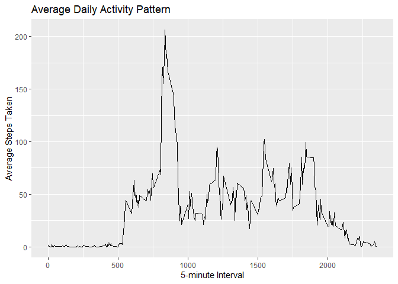
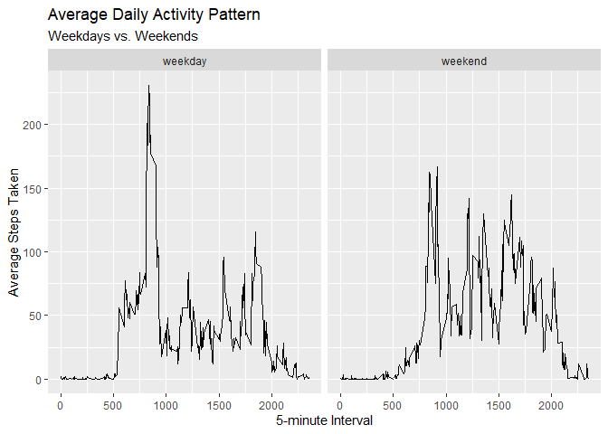

```r
library(readr); library(magrittr); library(lubridate)
```

```
## 
## Attaching package: 'lubridate'
```

```
## The following objects are masked from 'package:base':
## 
##     date, intersect, setdiff, union
```

```r
library(tidyverse)
```

```
## Warning: package 'tidyverse' was built under R version 4.2.1
```

```
## ── Attaching packages
## ───────────────────────────────────────
## tidyverse 1.3.2 ──
```

```
## ✔ ggplot2 3.3.6     ✔ dplyr   1.0.9
## ✔ tibble  3.1.8     ✔ stringr 1.4.0
## ✔ tidyr   1.2.0     ✔ forcats 0.5.1
## ✔ purrr   0.3.4
```

```
## Warning: package 'tibble' was built under R version 4.2.1
```

```
## ── Conflicts ────────────────────────────────────────── tidyverse_conflicts() ──
## ✖ lubridate::as.difftime() masks base::as.difftime()
## ✖ lubridate::date()        masks base::date()
## ✖ tidyr::extract()         masks magrittr::extract()
## ✖ dplyr::filter()          masks stats::filter()
## ✖ lubridate::intersect()   masks base::intersect()
## ✖ dplyr::lag()             masks stats::lag()
## ✖ purrr::set_names()       masks magrittr::set_names()
## ✖ lubridate::setdiff()     masks base::setdiff()
## ✖ lubridate::union()       masks base::union()
```


## Loading and preprocessing the data

Reading in the data and naming the data set `activity`. 


```r
activity <- read_csv("activity.zip")
```

```
## Rows: 17568 Columns: 3
## ── Column specification ────────────────────────────────────────────────────────
## Delimiter: ","
## dbl  (2): steps, interval
## date (1): date
## 
## ℹ Use `spec()` to retrieve the full column specification for this data.
## ℹ Specify the column types or set `show_col_types = FALSE` to quiet this message.
```

```r
view(activity)
```

Converting the `date` variable to a Date class. 


```r
activity <- activity %>% mutate(date = ymd(date))
```


## What is mean total number of steps taken per day?


```r
cc_activity <- activity %>% na.omit(.,) 

cc_activity <- cc_activity %>% 
  group_by(date) %>% 
  mutate(total_steps = sum(steps))
```


```r
ggplot(cc_activity, aes(x = total_steps)) +
  geom_histogram(fill = "pink", colour = "black") +
  labs(title = "Total Steps Taken Each Day",
       x = "Steps Taken",
       y = "Count")
```

```
## `stat_bin()` using `bins = 30`. Pick better value with `binwidth`.
```

<!-- -->


```r
summary(cc_activity)
```

```
##      steps             date               interval       total_steps   
##  Min.   :  0.00   Min.   :2012-10-02   Min.   :   0.0   Min.   :   41  
##  1st Qu.:  0.00   1st Qu.:2012-10-16   1st Qu.: 588.8   1st Qu.: 8841  
##  Median :  0.00   Median :2012-10-29   Median :1177.5   Median :10765  
##  Mean   : 37.38   Mean   :2012-10-30   Mean   :1177.5   Mean   :10766  
##  3rd Qu.: 12.00   3rd Qu.:2012-11-16   3rd Qu.:1766.2   3rd Qu.:13294  
##  Max.   :806.00   Max.   :2012-11-29   Max.   :2355.0   Max.   :21194
```


The mean total number of steps taken each day is **10766**, while the median total number of steps taken each day is **10765**.

## What is the average daily activity pattern?

To calculate the average number of steps for each interval across all days, I am grouping by `interval`, then using the `summarize` function to calculate the mean. This new calculated field is called `mean_steps` and it is saved in the `interval_steps` data frame. 


```r
interval_steps <- cc_activity %>% 
  group_by(interval) %>%
  summarize(mean_steps = mean(steps))
```


```r
ggplot(interval_steps, aes(x = interval, y = mean_steps)) +
  geom_line() +
  labs(title = "Average Daily Activity Pattern",
       x = "5-minute Interval",
       y = "Average Steps Taken")
```

<!-- -->


```r
interval_steps %>% arrange(desc(mean_steps))
```

```
## # A tibble: 288 × 2
##    interval mean_steps
##       <dbl>      <dbl>
##  1      835       206.
##  2      840       196.
##  3      850       183.
##  4      845       180.
##  5      830       177.
##  6      820       171.
##  7      855       167.
##  8      815       158.
##  9      825       155.
## 10      900       143.
## # … with 278 more rows
## # ℹ Use `print(n = ...)` to see more rows
```


The 5 minute interval with the maximum number of average steps is interval **835** with an average of **206** steps across all days. 


## Imputing missing values


```r
activity %>% 
  summarise_all(~sum(is.na(.)))
```

```
## # A tibble: 1 × 3
##   steps  date interval
##   <int> <int>    <int>
## 1  2304     0        0
```


The total number of missing values is **2,304**. All of the missing values are from the `steps` column. 


I am imputing the missing values in `steps` by replacing NA's with the calculated mean steps for each interval. 
This new data set containing the original data, plus the imputed values, is called `activity_imp`. 


```r
activity_imp <- activity %>% group_by(interval) %>%
  mutate(steps = replace_na(steps, mean(steps, na.rm = TRUE)))
```

Now I am creating a calculated field for total daily steps, similarily to what I did with the original `activity` data set. 


```r
activity_imp <- activity_imp %>% 
  group_by(date) %>% 
  mutate(total_steps = sum(steps))
```


```r
ggplot(activity_imp, aes(x = total_steps)) +
  geom_histogram(fill = "pink", colour = "black") +
  labs(title = "Total Steps Taken Each Day",
       subtitle = "Using data with imputations",
       x = "Steps Taken",
       y = "Count")
```

```
## `stat_bin()` using `bins = 30`. Pick better value with `binwidth`.
```

<!-- -->


```r
summary(activity_imp)
```

```
##      steps             date               interval       total_steps   
##  Min.   :  0.00   Min.   :2012-10-01   Min.   :   0.0   Min.   :   41  
##  1st Qu.:  0.00   1st Qu.:2012-10-16   1st Qu.: 588.8   1st Qu.: 9819  
##  Median :  0.00   Median :2012-10-31   Median :1177.5   Median :10766  
##  Mean   : 37.38   Mean   :2012-10-31   Mean   :1177.5   Mean   :10766  
##  3rd Qu.: 27.00   3rd Qu.:2012-11-15   3rd Qu.:1766.2   3rd Qu.:12811  
##  Max.   :806.00   Max.   :2012-11-30   Max.   :2355.0   Max.   :21194
```

After imputing missing values, the mean for the `acitivity_imp` data set if **10766** and the median is also **10766**. The mean for daily total steps stayed the same after imputing, while the median only increased by 1. There was not a noticeable impact of imputing missing data on the estimates of the total daily number of steps. 


## Are there differences in activity patterns between weekdays and weekends?


Creating the variable `weekday`, which is a factor that indicates whether a date falls on a weekday or weekend, with levels named appropriately. 


```r
activity_imp$weekday <- weekdays(activity_imp$date)

activity_imp <- activity_imp %>% 
  mutate(weekday = ifelse(weekday %in% c("Monday", "Tuesday", "Wednesday", "Thursday", "Friday"), "weekday",
                    ifelse(weekday %in% c("Saturday", "Sunday"), "weekend", "NA"))) %>%
  mutate(weekday = factor(weekday))
```

Calculating the average steps by interval and weekday category. 


```r
activity_imp <- activity_imp %>% 
  group_by(interval, weekday) %>% 
  mutate(mean_steps = mean(steps))
```


```r
ggplot(activity_imp, aes(x = interval, y = mean_steps)) +
  geom_line() +
  facet_wrap(~ weekday) +
  labs(title = "Average Daily Activity Pattern",
       subtitle = "Weekdays vs. Weekends",
       x = "5-minute Interval",
       y = "Average Steps Taken")
```

<!-- -->


There looks to be different average daily steps taken on weekdays compared to weekend days. 
